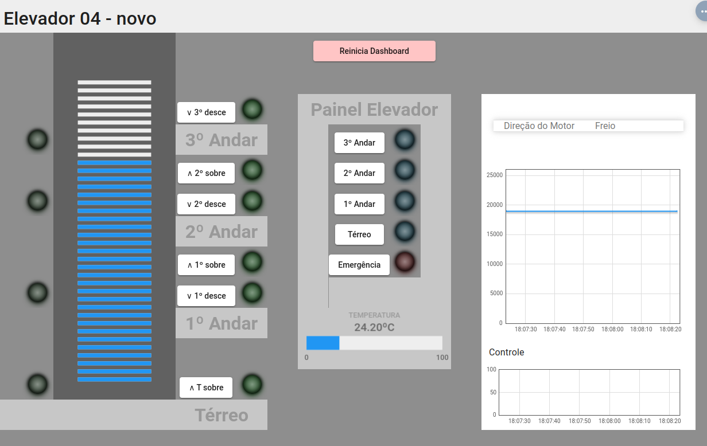
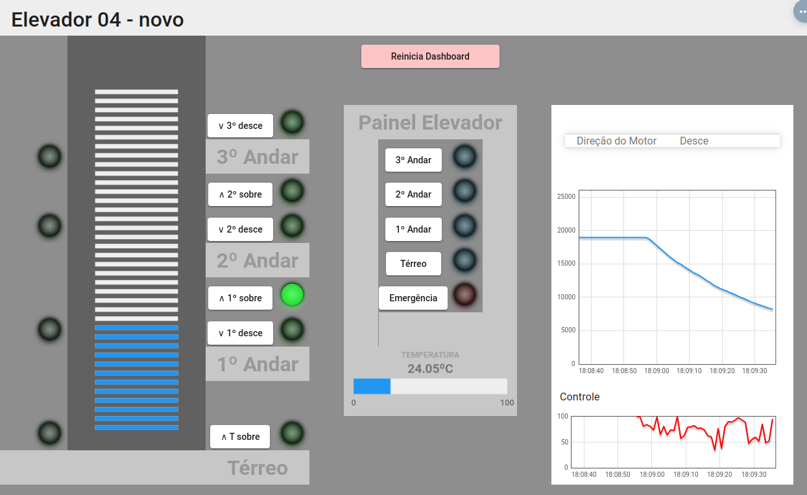
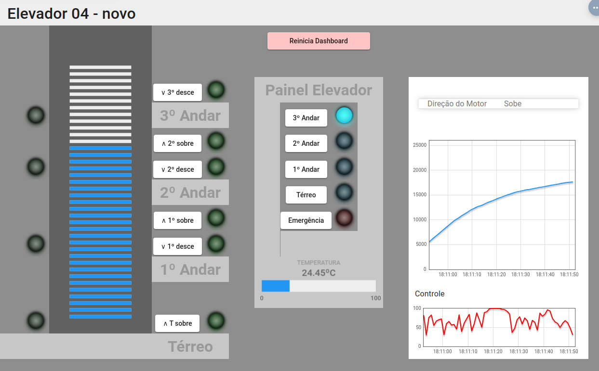

# Trabalho 2 - Controle de Elevador

**Sidney Fernando Ferreira Lemes**

## Execução

- Selecionar uma das Raspberry Pi 3 preparadas para o projeto
- Carregar os arquivos e diretórios desse repositório
- Instalar os [requirements](requirements.txt), caso necessário
- Executar ```main.py```

## Funcionamento

- A aplicação inicia executando a função main().
- O código realiza uma calibração inicial para obter as posições dos sensores do elevador.
- Após a calibração, uma thread é iniciada para gerenciar o display.

- Enquanto em execução, o sistema permanece em um loop verificando os sensores para identificar ações dos botões do elevador.
- Quando um botão é pressionado, o sistema determina a ação a ser executada, que é movimentar o elevador para um determinado andar.

- Ao detectar um botão pressionado, o elevador é movido até o andar solicitado usando um algoritmo de controle PID.
- Durante o movimento, o código monitora a posição atual do elevador e faz ajustes para garantir que ele atinja o andar desejado.

- Enquanto está em execução, o sistema atualiza o display com informações como a temperatura atual e o status do elevador.
- Também há um ciclo constante de leitura e envio da temperatura para ser exibida no display.

- Caso o botão de emergência seja pressionado, o código é encerrado imediatamente, freando o elevador e interrompendo todas as operações.

- Ao encerrar o programa, as conexões são fechadas, o sistema de controle do motor é desligado, e todos os recursos são liberados.

## Organização

O projeto visa desenvolver um software para controle completo de um elevador, abrangendo movimentação, botões internos/externos, temperatura, usando motor elétrico com controle PID e respondendo aos comandos dos usuários.


A estrutura do projeto é organizada em três diretórios principais: [__comunicacao__](comunicacao/), [__i2c__](i2c/) e [__modelo__](modelo/). O diretório "comunicacao" contém módulos para comunicação serial, cálculo de CRC16 e implementação do protocolo Modbus via UART. Em "i2c", estão presentes módulos para lidar com a comunicação I2C, o sensor de pressão Bmp280 e o display LCD. Já o diretório "modelo" engloba módulos relacionados ao controle do elevador, gerenciamento do motor, dos sensores e à implementação do algoritmo de controle PID para o motor elétrico. O arquivo "main.py" coordena a integração desses módulos para o funcionamento completo do sistema de controle do elevador.

### comunicacao

- [CodigoModbus.py](comunicacao/CodigoModbus.py): cria sequências de bytes com base nos códigos específicos do protocolo de comunicação. A função getCodigo() gera sequências de bytes para diferentes os códigos 'temperatura', 'solicita_encoder', 'sinal_PWM', 'le_registrador' e 'escreve_registrador', utilizando valores passados como argumentos ou uma tabela de endereços. Internamente, endereca_botao() mapeia os botões para endereços conforme a tabela predefinida.
- [Crc.py](comunicacao/Crc16.py): implementa uma função para calcular um código de redundância cíclica (CRC16) para uma sequência de bytes, utilizando a tabela de lookup para realizar os cálculos de verificação de erro.
- [Uart.py](comunicacao/Uart.py): define uma classe Uart para comunicação serial. Ela apresenta métodos para conectar e desconectar a porta serial, ler dados do encoder através da porta serial, validar o código de redundância cíclica (CRC), e escrever dados na porta serial, calculando e anexando o CRC aos dados antes de enviar.

### i2c

- [Bmp280.py](i2c/Bmp280.py): implementa uma classe que usa a biblioteca bmp280 para acessar o sensor de temperatura BMP280 via comunicação I2C na Raspberry Pi 3, oferecendo um método get_temp() que retorna a temperatura atual lida pelo sensor.
- [Lcd.py](i2c/Lcd.py): controla o display LCD através de comunicação I2C usando métodos para escrever comandos e caracteres no display.

### modelo

- [Elevador.py](modelo/Elevador.py): gerencia a fila de solicitações do elevador e manipula os registros que indicam os andares em que o elevador deve parar.
- [Motor.py](modelo/Motor.py): responsável pelo controle do motor do elevador. Ele configura os pinos GPIO do Raspberry Pi para controlar a direção do motor e o PWM (Pulse Width Modulation) para ajustar a velocidade. Fornece métodos para movimentar o elevador para cima, para baixo e para pará-lo, bem como para definir o estado do motor (subindo, descendo ou parado).
- [Pid.py](modelo/Pid.py): implementa o controlador PID (Proporcional, Integral, Derivativo), capaz de calcular um sinal de controle com base em uma referência desejada e na saída medida de um sistema. Ela utiliza os ganhos proporcionais, integrais e derivativos (kp, ki, kd) para calcular o sinal de controle, considerando o erro entre a referência e a saída medida, o erro acumulado ao longo do tempo (termo integral) e a variação do erro (termo derivativo) para ajustar a ação de controle. Além disso, limita o sinal de controle dentro de determinados limites máximos e mínimos.
- [Sensor.py](modelo/Sensor.py): lida com a detecção dos sensores nos diferentes andares do elevador. Além disso, é uma thread que executa continuamente, verificando os sensores e atualizando o andar ativo do elevador
  
### main.py

O módulo main representa o núcleo do sistema do elevador, coordenando diversas funcionalidades. Ele inicializa e controla os componentes essenciais, como o motor, sensor, comunicação UART, PID, dispositivo de sensor de temperatura, display LCD e a lógica do elevador. Por meio de threads, monitora a fila de chamadas de andares, movimenta o elevador conforme os andares requisitados, realiza a leitura da temperatura ambiente e exibe no display e, durante a inicialização, executa a calibração para determinar as posições dos andares. Ademais, gerencia a interrupção segura do programa, encerrando conexões e liberando recursos quando o sistema é finalizado ou interrompido.

## Experimentos

### Motor Parado



Na imagem acima é possível visualizar que o motor está em modo de frenagem e portanto, o elevador se mantém parado e não há sinal de controle.

### Motor Descendo



Na imagem acima, é perceptível que o elevador está em movimento descendente, enquanto o motor está sendo regulado pelo PID. Isso é evidenciado pela não linearidade tanto no gráfico de posição quanto no de controle.

### Motor Subindo



Na imagem acima, é possível notar que o elevador está subindo, enquanto o motor está sendo regulado pelo PID. Isso é evidenciado pela não linearidade tanto no gráfico de posição quanto no de controle.

## Video

<a href='https://youtu.be/HFJdgYnqC28'></a>

https://youtu.be/HFJdgYnqC28
